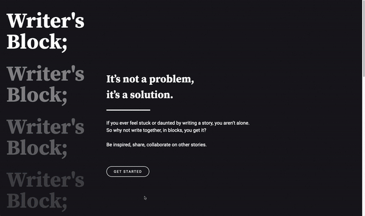
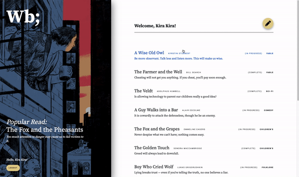

# Writer's Block; 

- Responsive full-stack web app for authors to create short stories and invite other users to continue the stories by giving them the ability to add contributions. Story contributions can be read and upvoted/downvoted by all registered users. Authors can merge the contributions that they like to their story and reject all other contributions.

- Multi-developer project built from start to finish and managed with Git throughout entire lifecycle
  - Collaborators: [Karen](https://github.com/careuno), [Lorenço](https://github.com/ocnerol), [Sameer](https://github.com/houseofsam)

## User Stories / Main Features
- Authors can start short stories
- Authors can decide whether or not other users on the platform are able to add further contributions to their stories
- When story contributions are permitted by the author, all registered users on the platform have the ability to add a contribution to an existing story, picking up from where the author or other contributors have left off
- All users are able to read stories and story contributions
- Registered users can provide feedback by upvoting or downvoting contributions
- Authors can merge any user contributions that they like regardless of the number of votes that a contribution has
- Mobile Responsive design

## Final Product
### Landing page followed by user upvoting a story contribution

### User adds a contribution to an existing short story

### User creates a new story

### Author merges a contribution made to their story and marks the story as complete, preventing further contributions

### Mobile Responsive Design

## Tech Stack
- PostgreSQL
- Node.js
- Express with EJS Template Engine
- jQuery
- Bootstrap
- SCSS

## Developer Notes / Installing the project

1. Create the `.env` by using `.env.example` as a reference: `cp .env.example .env`
2. Update the .env file with your correct local information 
  - username: `labber` 
  - password: `labber` 
  - database: `midterm`
3. Install dependencies: `npm i`
4. Fix to binaries for sass: `npm rebuild node-sass`
5. Reset database: `npm run db:reset`
  - Check the db folder to see what gets created and seeded in the SDB
7. Run the server: `npm run local`
  - Note: nodemon is used, so you should not have to restart your server
8. Visit `http://localhost:8080/`

- Ensure postgreSQL is setup on your machine with the database specified in the .env file
- Use the `npm run db:reset` command each time there is a change to the database schema or seeds. 
  - It runs through each of the files, in order, and executes them against the database. 
  - Note: you will lose all newly created (test) data each time this is run, since the schema files will tend to `DROP` the tables and recreate them.

## Dependencies

- Node v10.x or above
- NPM v5.x or above
- PG v6.x
- cookie-session v2.0.0
